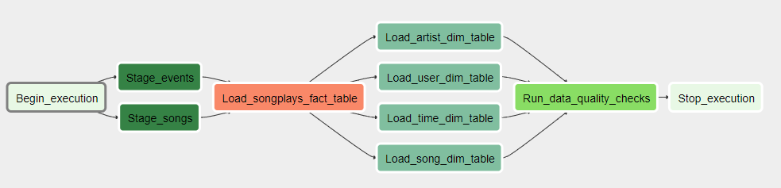

## Introduction
A music streaming startup, Sparkify, has grown their user base and song database and want to move their processes and data onto the cloud. Their data resides in S3, in a directory of JSON logs on user activity on the app, as well as a directory with JSON metadata on the songs in their app.

The goal of the project is building an ETL pipeline that loads data from S3, processes the data into analytics tables using Spark, and loads them back into S3. This Spark process will be deployed on a cluster using AWS.

## Datasets
The data sources for our data lake are provided by two public S3 buckets:

- Songs bucket (*s3://udacity-dend/song_data*) - this dataset is a subset of real data from the Million Song Dataset. Each file is in JSON format and contains metadata about a song and the artist of that song. The files are partitioned by the first three letters of each song's track ID.

- Event bucket (*s3://udacity-dend/log_data*) - consists of log files in JSON format generated by this event simulator based on the songs in the dataset above. These simulate app activity logs from an imaginary music streaming app based on configuration settings. The log files in the dataset you'll be working with are partitioned by year and month.

Below there is an example of how the logs file looks like:

## Project structure
Project consists of the following components:
1) dags/ - directory containing the main dag where data flow is defined
2) plugins/helpers/ - directory containing predefined SQL queries used in the process
3) plugins/operators/ - directory containing custom Airflow Operators used in the process
   * The StageToRedshiftOperator operator is used to load any JSON formatted files from S3 to Amazon Redshift. The operator creates and runs a SQL COPY statement based on the parameters provided. The operator's parameters specify where in S3 the file is loaded and what is the target table. The parameters also allow distinguishing between JSON file. 
   * LoadFactOperator, LoadDimensionOperator - these operators allow utilizing the provided SQL helper class to run data transformations. Most of the logic is within the SQL transformations and the operator takes as input a SQL statement and target database on which to run the query against.
Dimension loads are often done with the truncate-insert pattern where the target table is emptied before the load. Thus, there is also a parameter named insert_mode that allows switching between insert modes when loading dimensions. The available options are 'append' (default value) and 'delete-load'.
Fact tables are usually so massive that they should only allow append type functionality. 
   * DataQualityOperator - used to run checks on the data itself. The operator's main functionality is to receive one or more SQL based test cases along with the expected results and execute the tests. For each the test, the test result and expected result needs to be checked and if there is no match, the operator raises an exception and the task should retry and fail eventually.
For example one test is a SQL statement that checks if table is contains any records. Another test is to check if certain column contains NULL values by counting all the rows that have NULL in the column. We do not want to have any NULLs so expected result would be 0 and the test would compare the SQL statement's outcome to the expected result. 

## Star Schema
A star schema optimized for queries on song play analysis will be created using Spark. This includes the following tables:

**Fact Table**
1) songplays - records in log data associated with song plays i.e. records with page NextSong  
      *songplay_id, start_time, user_id, level, song_id, artist_id, session_id, location, user_agent*

**Dimension Tables**
1) users - users in the app  
      *user_id, first_name, last_name, gender, level*
2) songs - songs in music database  
      *song_id, title, artist_id, year, duration*
4) artists - artists in music database  
      *artist_id, name, location, lattitude, longitude*
6) time - timestamps of records in songplays broken down into specific units  
      *start_time, hour, day, week, month, year, weekday*

## Data pipeline
Data flow in the process is presented on the graph below:

